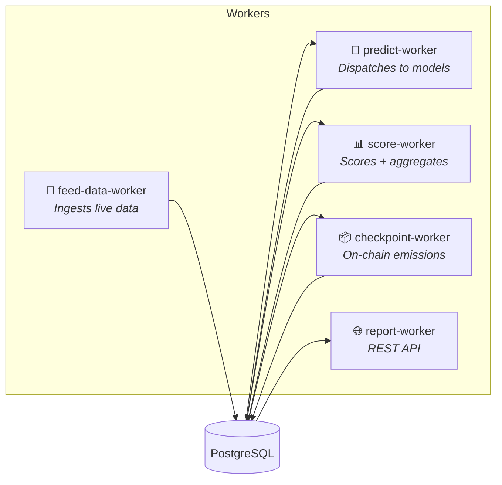

# Architecture Overview

The coordinator node is the runtime engine for Crunch competitions. It ingests live market data, dispatches predictions to registered models, scores results against ground truth, aggregates performance into leaderboards, and produces on-chain emission checkpoints.

## System Overview

```mermaid
graph TB
    subgraph External
        FEED[("Live Data Feeds<br/>(Pyth, Binance)")]
        MODELS["Model Containers<br/>(via model-orchestrator)"]
        CHAIN[("On-Chain<br/>Solana")]
        UI["Report UI<br/>(Next.js)"]
    end

    subgraph Coordinator Node
        FDW["feed-data-worker"]
        PW["predict-worker"]
        SW["score-worker"]
        CW["checkpoint-worker"]
        RW["report-worker<br/>(FastAPI)"]
        DB[("PostgreSQL")]
    end

    FEED -->|WebSocket / REST| FDW
    FDW -->|INSERT feed_records| DB
    FDW -->|pg_notify| PW
    PW -->|gRPC predict()| MODELS
    MODELS -->|inference output| PW
    PW -->|INSERT predictions| DB
    SW -->|READ pending predictions| DB
    SW -->|resolve ground truth| DB
    SW -->|INSERT scores, snapshots| DB
    SW -->|UPDATE leaderboard| DB
    CW -->|READ snapshots| DB
    CW -->|INSERT checkpoints| DB
    CW -->|submit emission| CHAIN
    RW -->|READ all tables| DB
    UI -->|HTTP API| RW

    style DB fill:#336,stroke:#fff,color:#fff
    style FEED fill:#553,stroke:#fff,color:#fff
    style CHAIN fill:#535,stroke:#fff,color:#fff
```

## Worker Architecture

Five independent workers run as separate Docker containers, communicating only through PostgreSQL:



| Worker | Container | Responsibility |
|--------|-----------|---------------|
| **feed-data-worker** | `crunch-node-*-feed-data-worker` | Connects to data feeds (Pyth, Binance), normalizes records, writes to `feed_records` table, sends `pg_notify` to trigger predictions |
| **predict-worker** | `crunch-node-*-predict-worker` | Listens for feed events, reads latest data, calls model containers via gRPC, stores `predictions` with scope and `resolvable_at` |
| **score-worker** | `crunch-node-*-score-worker` | Polls for resolvable predictions, fetches ground truth, runs scoring function, creates `scores` → `snapshots` → `leaderboard`, builds Merkle trees |
| **checkpoint-worker** | `crunch-node-*-checkpoint-worker` | Periodically aggregates snapshots into `checkpoints`, builds Merkle root, submits emission to chain |
| **report-worker** | `crunch-node-*-report-worker` | FastAPI server exposing all data via REST endpoints, serves the UI |

## Key Design Principles

### 1. Single Source of Truth
All type shapes and behavior are defined in one place: `CrunchConfig` (see [crunch-config.md](./crunch-config.md)). No separate JSON files, no contracts.py, no runtime_definitions.

### 2. Input is a Dumb Log
`InputRecord` = `{id, raw_data, received_at}`. Saved once, never updated. No status, no actuals, no scope. Ground truth is resolved from feed records, not from inputs.

### 3. Predictions Own Resolution
Each `PredictionRecord` carries its own `scope` (what was predicted) and `resolvable_at` (when ground truth can be resolved). The score worker queries `status=PENDING, resolvable_at <= now()`.

### 4. Type-Safe JSONB
Five Pydantic types define every data boundary. Raw dicts flow through `model_validate()` / `model_dump()` at each stage — no wrappers, no extra serialization layers.

### 5. Workers Communicate Only Through PostgreSQL
No message queues, no Redis. Workers read/write the same PostgreSQL database. `pg_notify` provides real-time triggers where needed (feed → predict).

## Repository Layout

```
crunch-node-starter/
├── crunch_node/       ← Engine (published to PyPI)
│   ├── workers/            ← Worker entry points
│   ├── services/           ← Business logic
│   ├── db/                 ← Tables, repositories, session
│   ├── feeds/              ← Data feed providers
│   ├── merkle/             ← Tamper evidence
│   ├── metrics/            ← Multi-metric computation
│   ├── extensions/         ← Callable resolution
│   ├── schemas/            ← API response schemas
│   ├── crunch_config.py    ← Base CrunchConfig class
│   ├── config_loader.py    ← Config discovery
│   └── alembic/            ← Database migrations
├── scaffold/               ← Template for new competitions
│   ├── node/               ← Node config, deployment, scripts
│   └── challenge/          ← Participant-facing package
├── tests/                  ← All tests
└── docker-compose.yml      ← Dev orchestration
```
