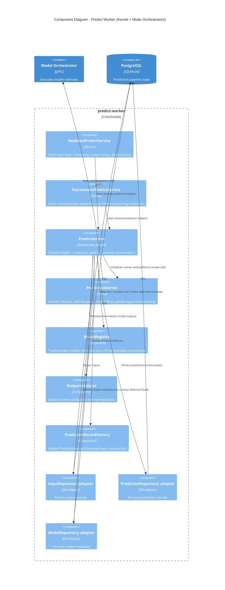

# C4 Level 3 — Component Diagram (Predict Worker / Kernel Refactor)

## Design rules captured by this component split

1. **Service-owned ingestion/streaming:** realtime/tournament services own their own trigger/data semantics.
2. **Kernel-owned model push path:** runner lifecycle, encoding, and model calls are centralized in `PredictionKernel`.
3. **Critical vs non-critical writes:** predictions are critical; model metadata is deferred/non-blocking.
4. **Single result mapping policy:** shared result/status/output mapping is centralized in base service logic.
