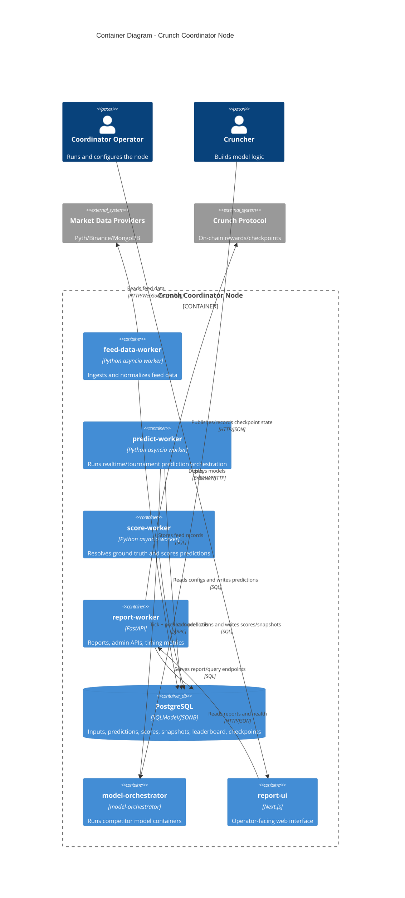

# C4 Level 2 — Container Diagram (Crunch Coordinator Node)

## Notes

- `predict-worker` hosts the refactored predict architecture:
  - mode orchestration in concrete services
  - shared kernel/primitives in `predict_components.py`
- Prediction persistence remains a **critical write path**.
- Model metadata persistence is **non-critical** and deferred behind the critical path.
