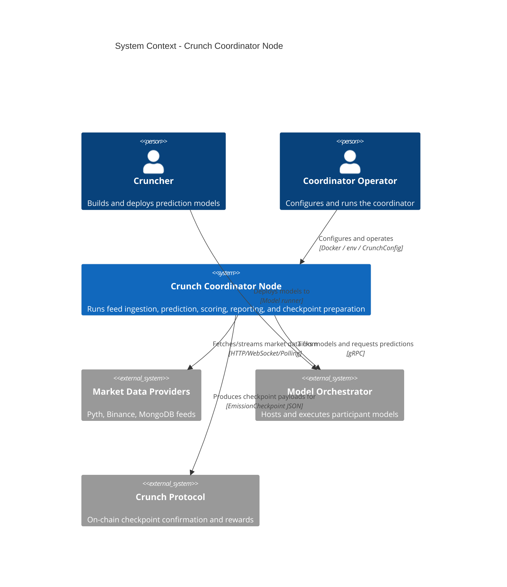

# C4 Level 1 — System Context (Crunch Coordinator Node)

## Scope

This diagram shows the coordinator node as a single system and its external
actors/systems. Internally, the node now uses a **predict kernel architecture**
that separates:

- **Mode-specific orchestration** (realtime/tournament flows)
- **Shared prediction primitives** (runner lifecycle, encoding, validation, record building)

The architecture target remains compatibility with **~50ms predict roundtrip**
(optimized path), while ensuring non-critical metadata persistence does not
block prediction flow.
