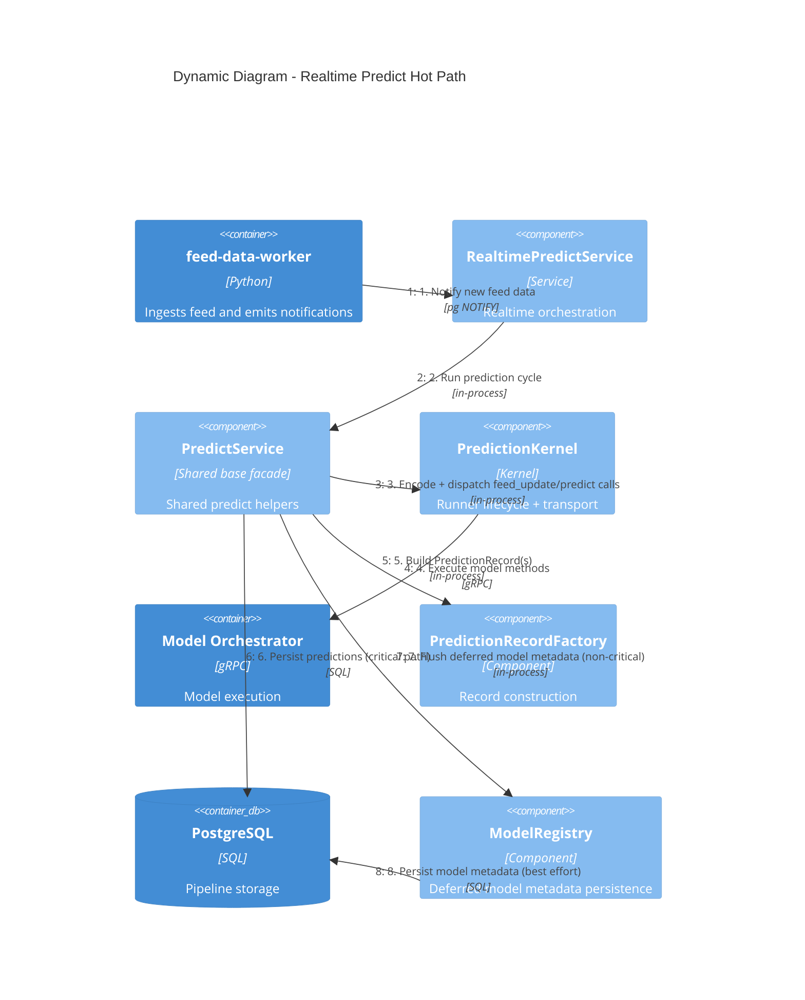

# C4 Dynamic — Realtime Predict Flow (Hot Path)

## Latency + reliability implications

- Steps **3 → 6** define most of the predict roundtrip cost.
- The architecture target is to remain compatible with **~50ms optimized roundtrip**.
- Model metadata persistence is intentionally moved after critical prediction
  persistence to prevent non-essential DB failures from stalling prediction flow.
