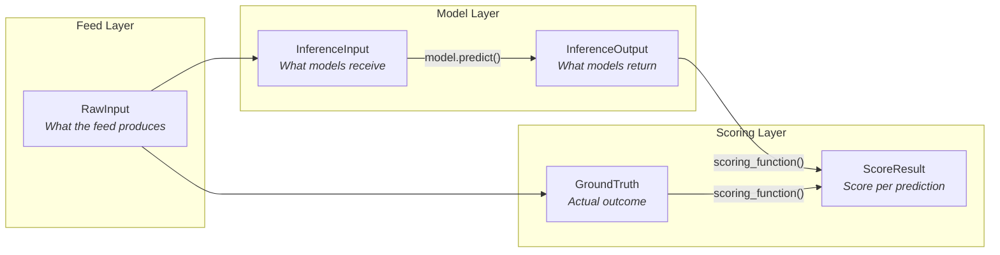
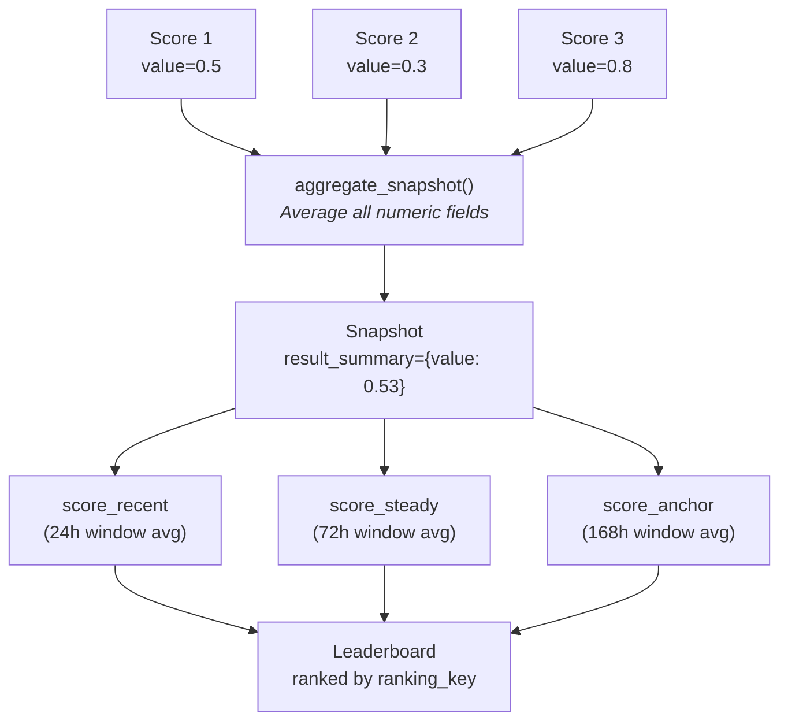

# CrunchConfig — Single Source of Truth

`CrunchConfig` is a Pydantic model that defines every data shape, scoring callable, aggregation strategy, and prediction schedule for a competition. Operators subclass it in `node/config/crunch_config.py`.

## Type System

Five Pydantic types define every data boundary in the pipeline:



| Type | Default Base | Purpose |
|------|-------------|---------|
| `raw_input_type` | `RawInput` | Shape of feed data as it arrives |
| `input_type` | `InferenceInput` | What models receive (defaults to same as RawInput) |
| `output_type` | `InferenceOutput` | What models must return (default: `{"value": float}`) |
| `ground_truth_type` | `GroundTruth` | Actual outcome for scoring (defaults to same as RawInput) |
| `score_type` | `ScoreResult` | Per-prediction score shape (default: `value`, `success`, `failed_reason`) |

All types use `model_config = ConfigDict(extra="allow")` so extra fields from feeds or models pass through without being dropped.

## Full Configuration

```python
class CrunchConfig(BaseModel):
    # ── Type shapes ──
    meta_type: type[BaseModel] = Meta
    raw_input_type: type[BaseModel] = RawInput
    ground_truth_type: type[BaseModel] = GroundTruth
    input_type: type[BaseModel] = InferenceInput
    output_type: type[BaseModel] = InferenceOutput
    score_type: type[BaseModel] = ScoreResult

    # ── Prediction context ──
    scope: PredictionScope = PredictionScope()          # default subject, step_seconds
    call_method: CallMethodConfig = CallMethodConfig()  # gRPC method + args

    # ── Aggregation ──
    aggregation: Aggregation = Aggregation()
    # aggregation.value_field = "value"        # score field to average in windows
    # aggregation.ranking_key = "score_recent" # metric to rank by
    # aggregation.windows = {"score_recent": 24h, "score_steady": 72h, "score_anchor": 168h}

    # ── Schedules ──
    scheduled_predictions: list[ScheduledPrediction] = [...]

    # ── Multi-metric scoring ──
    metrics: list[str] = ["ic", "ic_sharpe", "hit_rate", "max_drawdown", "model_correlation"]
    compute_metrics: Callable = default_compute_metrics

    # ── Ensembles ──
    ensembles: list[EnsembleConfig] = []

    # ── On-chain identifiers ──
    crunch_pubkey: str = ""
    compute_provider: str | None = None
    data_provider: str | None = None

    # ── Callables ──
    scoring_function: Callable | None = None         # (prediction, ground_truth) → score_dict
    resolve_ground_truth: Callable = default_resolve_ground_truth
    aggregate_snapshot: Callable = default_aggregate_snapshot
    build_emission: Callable = default_build_emission
```

## Scheduled Predictions

Define what to predict, how often, and when to resolve:

```python
scheduled_predictions = [
    ScheduledPrediction(
        scope_key="BTC-60",
        scope={"subject": "BTC"},
        prediction_interval_seconds=15,   # call models every 15s
        resolve_horizon_seconds=60,       # score after 60s
    ),
    ScheduledPrediction(
        scope_key="ETH-300",
        scope={"subject": "ETH"},
        prediction_interval_seconds=60,
        resolve_horizon_seconds=300,
    ),
]
```

## CallMethodConfig

Controls how the coordinator invokes models via gRPC:

```python
# Default: predict(subject="BTC", resolve_horizon_seconds=60, step_seconds=15)
call_method = CallMethodConfig(
    method="predict",
    args=[
        CallMethodArg(name="subject", type="STRING"),
        CallMethodArg(name="resolve_horizon_seconds", type="INT"),
        CallMethodArg(name="step_seconds", type="INT"),
    ],
)

# Custom: trade(symbol="BTCUSDT")
call_method = CallMethodConfig(
    method="trade",
    args=[CallMethodArg(name="symbol", type="STRING")],
)
```

## Aggregation



| Field | Default | Purpose |
|-------|---------|---------|
| `value_field` | `"value"` | Which score field to read from snapshots for window averaging |
| `ranking_key` | `"score_recent"` | Which metric to rank by (window name or score field) |
| `ranking_direction` | `"desc"` | `"desc"` = higher is better, `"asc"` = lower is better |
| `windows` | 24h / 72h / 168h | Rolling time windows for score aggregation |

## Config Loading

`config_loader.load_config()` resolves the config in order:

1. `CRUNCH_CONFIG_MODULE` env var (e.g. `config.crunch_config:CrunchConfig`)
2. Default path: `config/crunch_config.py` with class named `CrunchConfig`
3. Engine default: `coordinator_node.crunch_config:CrunchConfig`

## Customization Example

```python
# node/config/crunch_config.py
from coordinator_node.crunch_config import (
    CrunchConfig as BaseCrunchConfig,
    InferenceOutput,
    ScoreResult,
    ScheduledPrediction,
    Aggregation,
    AggregationWindow,
)
from pydantic import BaseModel, ConfigDict, Field

class MyOutput(BaseModel):
    direction: str = "hold"
    confidence: float = 0.0
    size: float = 0.0

class MyScore(BaseModel):
    model_config = ConfigDict(extra="allow")
    pnl: float = 0.0
    sharpe: float = 0.0
    max_drawdown: float = 0.0
    success: bool = True
    failed_reason: str | None = None

class CrunchConfig(BaseCrunchConfig):
    output_type = MyOutput
    score_type = MyScore

    aggregation = Aggregation(
        value_field="pnl",
        ranking_key="score_recent",
        windows={
            "score_recent": AggregationWindow(hours=24),
            "score_steady": AggregationWindow(hours=168),
        },
    )

    scheduled_predictions = [
        ScheduledPrediction(
            scope_key="BTC-live",
            scope={"subject": "BTC"},
            prediction_interval_seconds=60,
            resolve_horizon_seconds=0,  # immediate
        ),
    ]

    scoring_function = my_custom_scorer  # stateful or stateless
```
