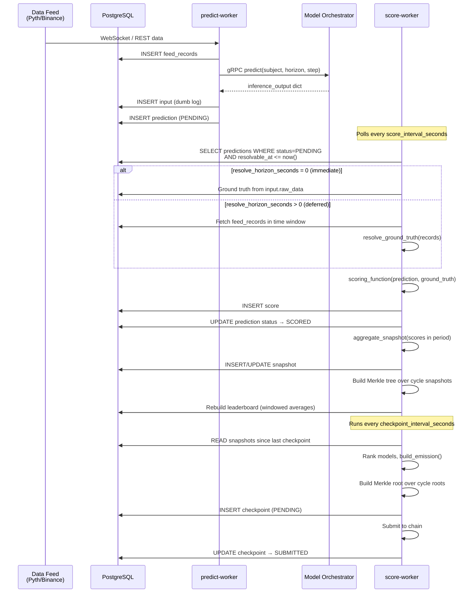
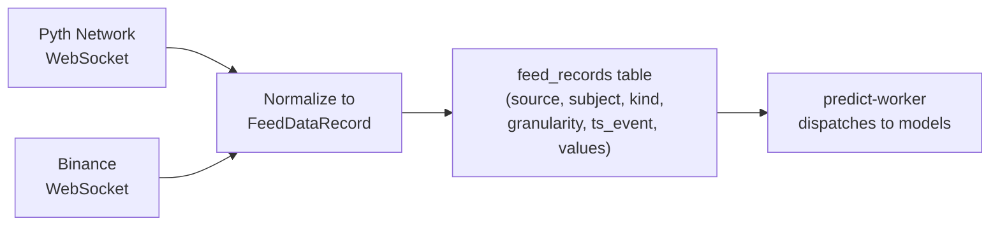
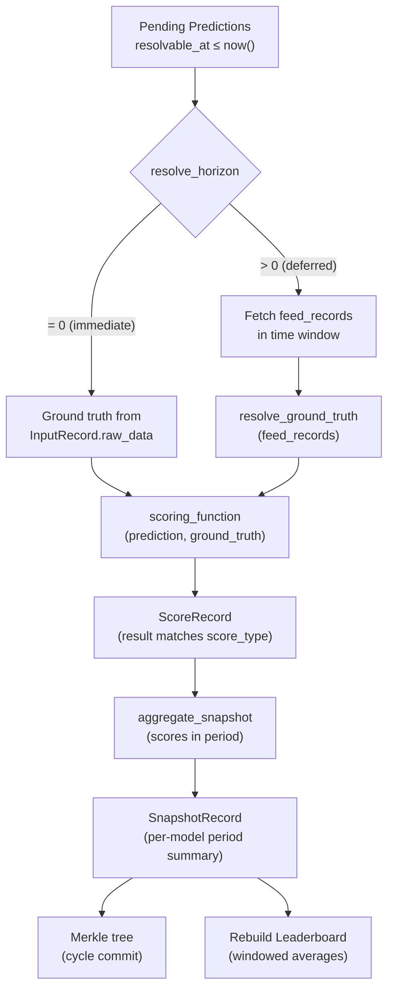
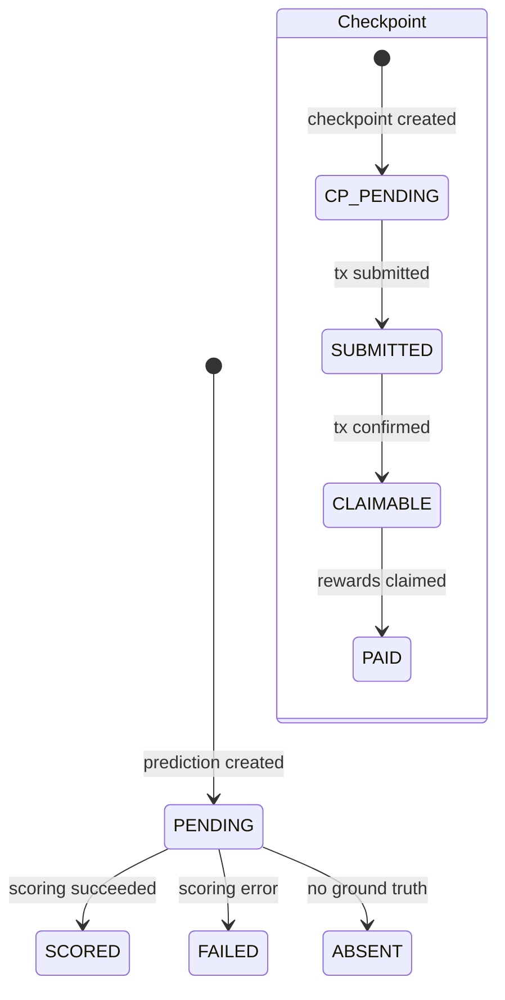

# Data Pipeline

The crunch node runs a continuous pipeline that transforms live market data into ranked leaderboard entries and on-chain checkpoints.

## End-to-End Flow



## Pipeline Stages

### Stage 1: Feed Ingestion & Prediction

The **predict-worker** connects to external data sources, writes normalized records, and dispatches predictions:



Feed records have four generic dimensions:
- **source** — `pyth`, `binance`, etc.
- **subject** — `BTC`, `ETHUSDT`, etc.
- **kind** — `tick`, `candle`, `depth`, `funding`
- **granularity** — `1s`, `1m`, `5m`, `1h`

The predict-worker:

1. Reads latest feed data from the database
2. Calls each registered model via gRPC through the model orchestrator
3. Stores the raw feed data as an `InputRecord` (dumb log — never updated)
4. Stores each model's response as a `PredictionRecord` with:
   - `scope_key` — which prediction config triggered this
   - `scope_jsonb` — full scope context (subject, step_seconds, etc.)
   - `resolvable_at` — when ground truth can be resolved
   - `inference_output_jsonb` — the model's raw output

### Stage 2: Scoring

The **score-worker** resolves predictions and computes scores:



### Stage 3: Checkpointing

The **score-worker** also periodically aggregates snapshots into on-chain checkpoints:

1. Reads all snapshots since the last checkpoint
2. Ranks models using the leaderboard's `ranking_key`
3. Calls `build_emission()` to compute reward distribution
4. Builds a Merkle root over all cycle roots for tamper evidence
5. Submits the `EmissionCheckpoint` to the blockchain
6. Updates checkpoint status: `PENDING → SUBMITTED → CLAIMABLE → PAID`

## Status Lifecycles



## Timing

```
t=0          t=interval        t=interval+horizon     t=interval+horizon+score_interval
 │               │                    │                         │
 │  Feed data    │  predict()         │  resolvable_at          │  score()
 │  arrives      │  called            │  reached                │  runs
 └───────────────┴────────────────────┴─────────────────────────┘
```

- **`prediction_interval_seconds`** — how often models are called (e.g. every 15s)
- **`resolve_horizon_seconds`** — delay before scoring (0 = immediate, 60 = wait 1 minute for ground truth)
- **`score_interval_seconds`** — how often the score worker polls (auto-set to min(60, checkpoint_interval))
- **`checkpoint_interval_seconds`** — how often checkpoints are created (e.g. weekly)
