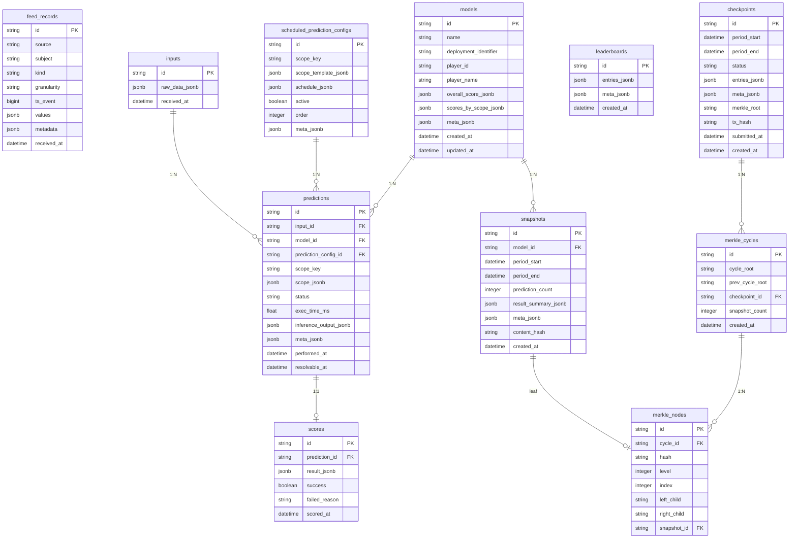

# Database Schema

All data is stored in PostgreSQL using SQLModel (SQLAlchemy + Pydantic). JSONB columns store typed data that passes through Pydantic `model_validate()` / `model_dump()` at every boundary.

## Entity Relationship Diagram

## Tables

### `feed_records`
Raw data from external feeds. Immutable append-only log with four dimensions: source, subject, kind, granularity.

### `inputs`
Dumb log of what was sent to models. `raw_data_jsonb` matches `RawInput`. Saved once, never updated.

### `models`
Registered model containers. `overall_score_jsonb` and `scores_by_scope_jsonb` are denormalized from leaderboard.

### `scheduled_prediction_configs`
Seeded from `CrunchConfig.scheduled_predictions` at init. Defines scope, schedule, and ordering for each prediction type.

### `predictions`
Core pipeline record. Each prediction carries:
- `scope_key` + `scope_jsonb` — what was predicted
- `resolvable_at` — when ground truth can be resolved
- `inference_output_jsonb` — the model's raw output (matches `InferenceOutput`)
- `status` — lifecycle: `PENDING → SCORED | FAILED | ABSENT`

### `scores`
One score per prediction. `result_jsonb` matches `ScoreResult`. Failed scores have `success=false` and `failed_reason`.

### `snapshots`
Per-model period summary. `result_summary_jsonb` is the output of `aggregate_snapshot()` — averages of all numeric score fields over the period. `content_hash` enables Merkle inclusion proofs.

### `leaderboards`
Point-in-time leaderboard. `entries_jsonb` contains ranked entries with windowed metrics. Rebuilt after each score cycle.

### `checkpoints`
On-chain emission records. Status lifecycle: `PENDING → SUBMITTED → CLAIMABLE → PAID`. Contains `merkle_root` for tamper evidence and `tx_hash` after submission.

### `merkle_cycles` / `merkle_nodes`
Tamper evidence. Each score cycle produces a mini Merkle tree over its snapshots. Cycles are chained (each stores `prev_cycle_root`). At checkpoint time, a tree over cycle roots produces the checkpoint's `merkle_root`.

## JSONB Column Mapping

| Column | Pydantic Type | Set By |
|--------|--------------|--------|
| `inputs.raw_data_jsonb` | `RawInput` | feed-data-worker |
| `predictions.scope_jsonb` | `PredictionScope` | predict-worker |
| `predictions.inference_output_jsonb` | `InferenceOutput` | predict-worker |
| `scores.result_jsonb` | `ScoreResult` | score-worker |
| `snapshots.result_summary_jsonb` | `dict` (from `aggregate_snapshot`) | score-worker |
| `leaderboards.entries_jsonb` | `list[dict]` (ranked entries) | score-worker |
| `checkpoints.entries_jsonb` | `list[dict]` (emission entries) | checkpoint-worker |
