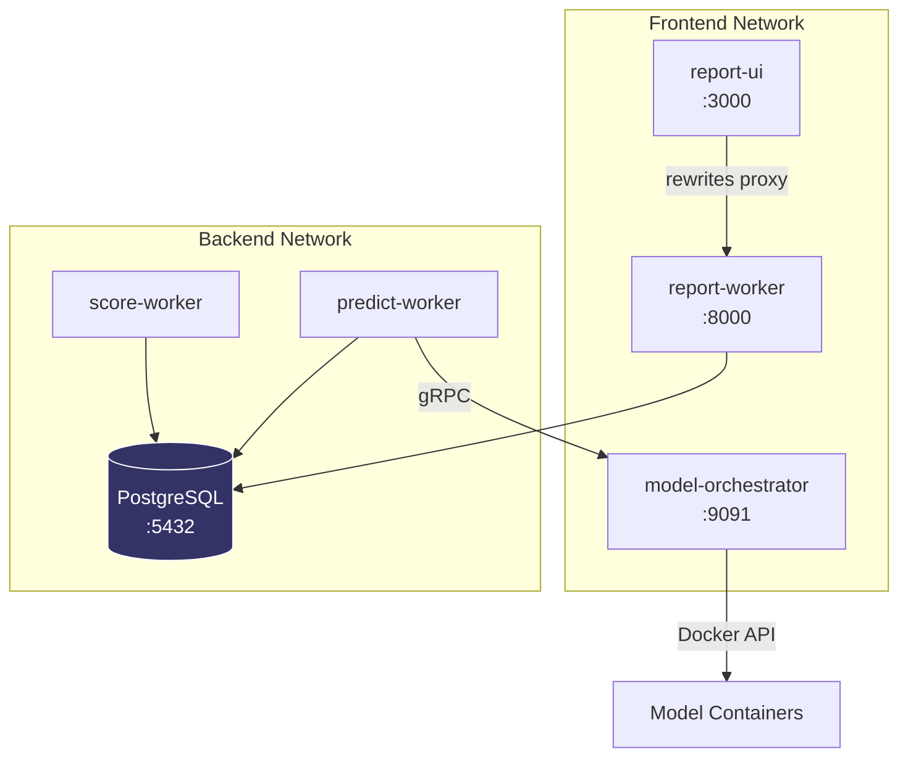
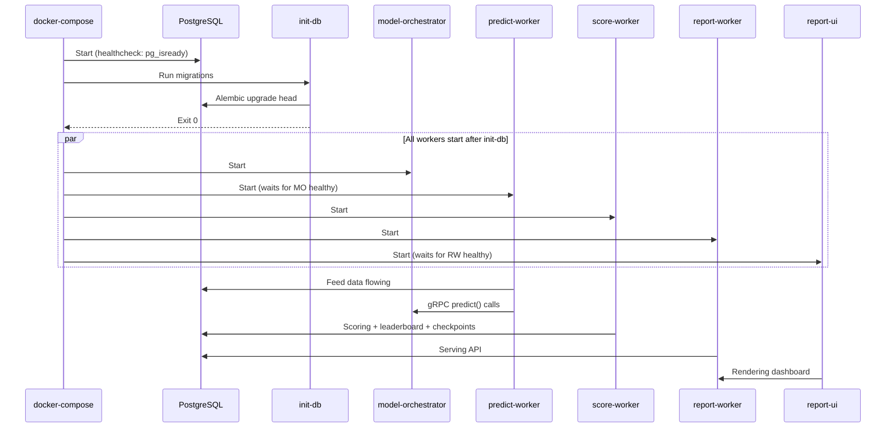

# Deployment & Operations

## Docker Compose Architecture



## Services

| Service | Port | Purpose |
|---------|------|---------|
| `postgres` | 5432 | Database — all pipeline data |
| `init-db` | — | One-shot: runs migrations then exits |
| `predict-worker` | — | Ingests feed data + dispatches predictions to models |
| `score-worker` | — | Scores predictions, builds leaderboard, creates checkpoints |
| `report-worker` | 8000 | FastAPI REST API |
| `model-orchestrator` | 9091 | Manages model containers |
| `report-ui` | 3000 | Next.js dashboard |

## Environment Variables

### Core

| Variable | Default | Description |
|----------|---------|-------------|
| `CRUNCH_ID` | `starter-challenge` | Competition identifier |
| `DATABASE_URL` | `postgresql://...` | PostgreSQL connection string |
| `CRUNCH_CONFIG_MODULE` | `config.crunch_config:CrunchConfig` | Config class path |

### Feed

| Variable | Default | Description |
|----------|---------|-------------|
| `FEED_SOURCE` | `pyth` | Data feed provider |
| `FEED_SUBJECTS` | `BTC` | Comma-separated subjects |
| `FEED_KIND` | `tick` | Data kind |
| `FEED_GRANULARITY` | `1s` | Data granularity |

### Timing

| Variable | Default | Description |
|----------|---------|-------------|
| `CHECKPOINT_INTERVAL_SECONDS` | `604800` | Checkpoint frequency (default: weekly) |
| `SCORE_INTERVAL_SECONDS` | `60` | Score worker poll frequency |

### Security

| Variable | Default | Description |
|----------|---------|-------------|
| `API_KEY` | _(none)_ | If set, all API endpoints require `Authorization: Bearer <key>` |

### On-Chain

| Variable | Default | Description |
|----------|---------|-------------|
| `CRUNCH_PUBKEY` | — | Crunch account public key |
| `NETWORK` | `devnet` | Solana network (`devnet`, `mainnet-beta`) |

### UI

| Variable | Default | Description |
|----------|---------|-------------|
| `NEXT_PUBLIC_API_URL` | `http://report-worker:8000` | API URL for UI (must be Docker-internal!) |
| `REPORT_UI_APP` | `starter` | Which UI app to build (`starter`, `platform`) |

> ⚠️ **`NEXT_PUBLIC_API_URL` must be Docker-internal.** The UI's Next.js `rewrites()` proxy runs server-side inside Docker. Never set to `localhost`.
> - ✅ `http://report-worker:8000`
> - ❌ `http://localhost:8000` → ECONNREFUSED inside container

## Commands

### Workspace root (proxies to node/)

```bash
make deploy         # Validate → build → start all services
make preflight      # deploy → check-models → verify-e2e
make verify-e2e     # API + container + pipeline checks
make check-models   # Verify model runners are healthy
make logs           # Stream all service logs
make down           # Tear down all containers
make init-db        # Initialize database
make reset-db       # Reset database
make backfill       # Backfill historical feed data
make test           # Run challenge unit tests
```

### Switching UI

```bash
make starter        # Switch to starter UI (local API)
make platform       # Switch to platform UI (hub API)
```

## Startup Sequence



## Monitoring Checklist

After deployment, verify continuously for at least 20 minutes:

- [ ] All containers running (`docker ps`)
- [ ] No errors/tracebacks in `docker compose logs`
- [ ] API endpoints return fresh data (`curl localhost:8000/reports/leaderboard`)
- [ ] DB records match API responses (counts, timestamps, scores)
- [ ] UI pages render data consistent with API/DB
- [ ] Pipeline flowing: new predictions appearing, scores being computed
- [ ] Leaderboard updating with windowed averages

## Troubleshooting

### Ports in use
```bash
lsof -nP -iTCP:3000 -sTCP:LISTEN   # report-ui
lsof -nP -iTCP:8000 -sTCP:LISTEN   # report-worker
lsof -nP -iTCP:9091 -sTCP:LISTEN   # model-orchestrator
lsof -nP -iTCP:5432 -sTCP:LISTEN   # postgres
```

### Model failures (BAD_IMPLEMENTATION)
- Check `MODEL_BASE_CLASSNAME=tracker.TrackerBase` in `.local.env`
- Verify challenge package in `pyproject.toml` under `[tool.uv.sources]`
- Run `make check-models` for detailed diagnostics

### Clean reset
```bash
make down
rm -rf .venv
make deploy
make verify-e2e
```
