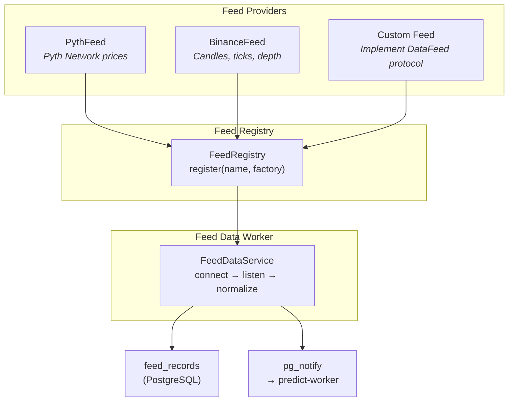

# Feed System

The feed system provides a pluggable interface for ingesting live market data from external sources.

## Architecture



## DataFeed Protocol

All feed providers implement this protocol:

```python
class DataFeed(Protocol):
    async def list_subjects(self) -> Sequence[SubjectDescriptor]:
        """Discover available symbols and their capabilities."""
        ...

    async def listen(self, subscription: FeedSubscription, sink: FeedSink) -> FeedHandle:
        """Push mode: stream live data to the sink."""
        ...

    async def fetch(self, request: FeedFetchRequest) -> Sequence[FeedDataRecord]:
        """Pull mode: fetch historical data (backfill + truth windows)."""
        ...
```

## FeedDataRecord

All data is normalized to a canonical shape:

```python
@dataclass(frozen=True)
class FeedDataRecord:
    source: str           # "pyth", "binance"
    subject: str          # "BTC", "ETHUSDT"
    kind: FeedDataKind    # "tick", "candle", "depth", "funding"
    granularity: str      # "1s", "1m", "5m", "1h"
    ts_event: int         # Unix timestamp (ms)
    values: dict          # {"open": ..., "high": ..., "low": ..., "close": ..., "volume": ...}
    metadata: dict        # Provider-specific extras
```

## Feed Dimensions

Four generic dimensions organize feed data:

| Dimension | Env Var | Examples |
|-----------|---------|----------|
| **source** | `FEED_SOURCE` | `pyth`, `binance` |
| **subject** | `FEED_SUBJECTS` | `BTC`, `ETHUSDT`, `BTC,ETH,SOL` |
| **kind** | `FEED_KIND` | `tick`, `candle`, `depth`, `funding` |
| **granularity** | `FEED_GRANULARITY` | `1s`, `1m`, `5m`, `1h` |

## Built-in Providers

### Pyth Network
- **Source**: `pyth`
- **Kinds**: `tick`
- **Mode**: WebSocket streaming from Pyth Hermes
- **Data**: Real-time price feeds for crypto assets

### Binance
- **Source**: `binance`
- **Kinds**: `candle`, `tick`, `depth`, `funding`
- **Mode**: WebSocket streaming + REST for backfill
- **Data**: OHLCV candles, trades, order book depth, funding rates

## Backfill

The `backfill.py` script fetches historical data using the `fetch()` pull interface:

```bash
make backfill SOURCE=binance SUBJECT=BTC KIND=candle GRANULARITY=1m \
    FROM=2024-01-01 TO=2024-01-31
```

This populates `feed_records` with historical data, enabling:
- Backtesting models against real historical data
- Seeding ground truth for deferred-resolution scoring
- Filling gaps after downtime

## Adding a Custom Feed Provider

1. Implement the `DataFeed` protocol:

```python
class MyFeed:
    async def list_subjects(self) -> list[SubjectDescriptor]:
        return [SubjectDescriptor(
            symbol="CUSTOM",
            display_name="Custom Data",
            kinds=("tick",),
            granularities=("1s",),
            source="my-source",
        )]

    async def listen(self, subscription, sink) -> FeedHandle:
        # Connect to your data source, call sink.on_record() for each update
        ...

    async def fetch(self, request) -> list[FeedDataRecord]:
        # Return historical records for backfill
        ...
```

2. Register in the feed registry:

```python
from crunch_node.feeds.registry import get_default_registry
registry = get_default_registry()
registry.register("my-source", lambda: MyFeed())
```
