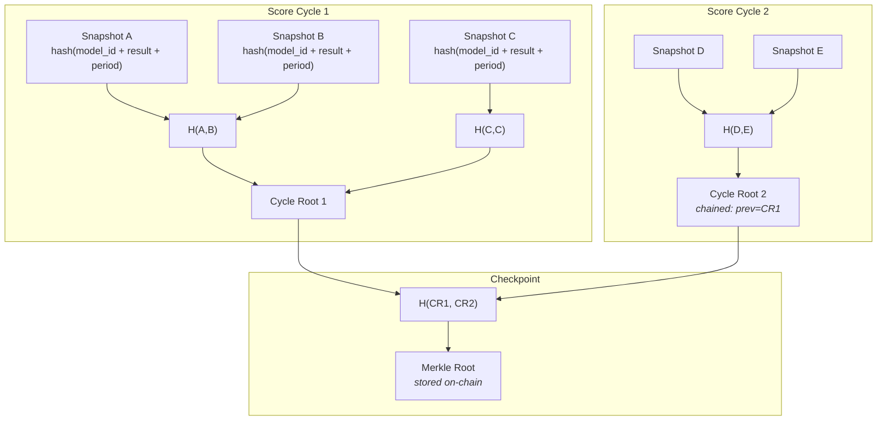

# Merkle Tamper Evidence

The coordinator builds Merkle trees over scores and snapshots to provide cryptographic proof that results haven't been altered after the fact.

## How It Works



## Three-Level Structure

### Level 1: Snapshot Hashing
Each snapshot gets a canonical hash from its content:

```python
canonical_snapshot_hash(snapshot) = SHA256(
    model_id + period_start + period_end + 
    sorted(result_summary key-value pairs)
)
```

The hash is stored as `content_hash` on the `SnapshotRow`.

### Level 2: Cycle Trees
After each score cycle, a Merkle tree is built over the cycle's snapshot hashes. The root is stored as a `MerkleCycleRow` with:
- `cycle_root` — the Merkle root of this cycle's snapshots
- `prev_cycle_root` — hash chain to previous cycle (tamper evidence for ordering)
- `snapshot_count` — number of snapshots in the cycle

### Level 3: Checkpoint Trees
At checkpoint time, a Merkle tree is built over all cycle roots since the last checkpoint. The root becomes the checkpoint's `merkle_root`, which is submitted on-chain.

## Verification

### Inclusion Proof
Given a snapshot ID, the system generates a Merkle inclusion proof:

```python
proof = merkle_service.get_proof(snapshot_id)
# Returns: MerkleProof(leaf_hash, siblings, root)
```

Anyone can verify that a specific snapshot's data was included in a checkpoint by:
1. Recomputing the snapshot's canonical hash from its data
2. Walking the sibling hashes up to the cycle root
3. Walking cycle roots up to the checkpoint's Merkle root
4. Comparing against the on-chain Merkle root

### Chain Integrity
Cycle roots form a hash chain (`prev_cycle_root`). Any insertion, deletion, or reordering of cycles breaks the chain.

## API Endpoints

| Endpoint | Description |
|----------|-------------|
| `GET /reports/merkle/cycles` | List all Merkle cycles with roots and chain links |
| `GET /reports/merkle/cycles/{id}/proof` | Inclusion proof for a specific snapshot |

## Why This Matters

In a decentralized competition:
- **Coordinators can't retroactively change scores** — the Merkle root is on-chain
- **Participants can verify their scores** — inclusion proofs are publicly auditable
- **Ordering is tamper-evident** — the hash chain prevents reordering cycles
- **Checkpoints are binding** — the Merkle root commits to all scores in the period
