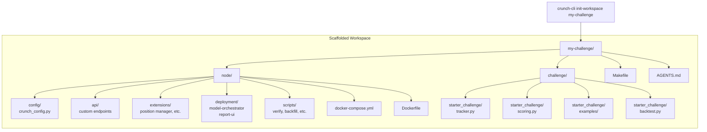
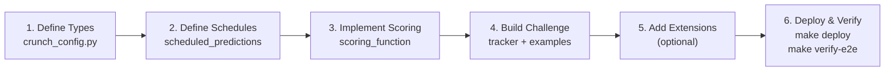

# Scaffold Template

The `scaffold/` directory is the template used by `crunch-cli init-workspace` to create new competition workspaces. It contains everything needed to run a crunch node without touching engine code.

## What Gets Scaffolded



## Directory Structure

```
scaffold/
├── AGENTS.md                  ← Agent instructions (monitoring, commands, troubleshooting)
├── Makefile                   ← Workspace-level commands (proxy to node/)
├── node/
│   ├── config/
│   │   └── crunch_config.py   ← THE file to customize (types, scoring, schedules)
│   ├── api/                   ← Custom FastAPI endpoints (auto-discovered)
│   ├── extensions/            ← Node-side extensions (stateful scoring, etc.)
│   ├── deployment/
│   │   ├── model-orchestrator-local/  ← Local model runner config
│   │   └── report-ui/                ← UI config (global settings, columns, widgets)
│   ├── scripts/               ← Operational scripts (verify, backfill, validate)
│   ├── docker-compose.yml     ← Service orchestration
│   ├── Dockerfile             ← Installs crunch-node from PyPI + challenge package
│   ├── Makefile               ← Node-level commands
│   └── .local.env             ← Environment configuration
└── challenge/
    ├── starter_challenge/
    │   ├── tracker.py         ← Model interface (participants implement this)
    │   ├── scoring.py         ← Local self-eval scoring
    │   ├── backtest.py        ← Backtest harness
    │   ├── config.py          ← Baked-in coordinator URL + defaults
    │   └── examples/          ← Quickstarter models (~5 simple, predictable)
    ├── tests/                 ← Challenge unit tests
    └── pyproject.toml         ← Challenge package definition
```

## Customization Flow



### Step 1: Define Types
In `node/config/crunch_config.py`, override the Pydantic types:
- `output_type` — what models return
- `score_type` — what scoring produces
- `raw_input_type` / `ground_truth_type` — if feed data shape differs

### Step 2: Define Schedules
Set `scheduled_predictions` — what to predict, how often, when to resolve.

### Step 3: Implement Scoring
Either set `scoring_function` directly on the config (supports stateful scoring) or point the `SCORING_FUNCTION` env var to a module path.

### Step 4: Build Challenge
In `challenge/starter_challenge/`:
- Define `TrackerBase` subclass interface in `tracker.py`
- Implement local self-eval scoring in `scoring.py`
- Build quickstarter examples in `examples/`
- Set up backtest harness in `backtest.py`

### Step 5: Add Extensions (optional)
- Custom API endpoints in `node/api/`
- Stateful extensions in `node/extensions/`
- Custom deployment configs in `node/deployment/`

### Step 6: Deploy & Verify
```bash
make deploy
make verify-e2e
```

## How It Connects to the Engine

The scaffolded `Dockerfile` installs `crunch-node` from PyPI:

```dockerfile
ARG COORDINATOR_NODE_VERSION=0.1.79
RUN pip install --no-cache-dir "crunch-node>=${COORDINATOR_NODE_VERSION}"

# Challenge package
COPY challenge ./challenge
RUN pip install --no-cache-dir ./challenge

# Operator config
COPY node/config ./config
```

The engine discovers the operator's `CrunchConfig` subclass at startup via `config_loader.load_config()`. No engine code modification needed.

## Test Models

The `examples/` folder should contain **~5 simple, predictable models** for end-to-end production testing:

- **Simple logic** — always-long, always-short, mean-reversion, trend-follow, seeded-random
- **Predictable outputs** — given the same input, roughly the same score/ranking
- **Diverse** — cover different edge cases
- **Fast** — no heavy computation
- **Contract-compliant** — pass all tests, match `output_type`

After deployment, these models validate the entire pipeline (feed → predict → score → snapshot → leaderboard) produces consistent data across API, DB, and UI.
