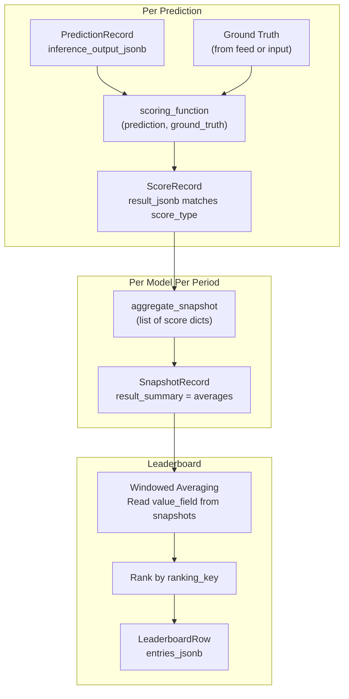
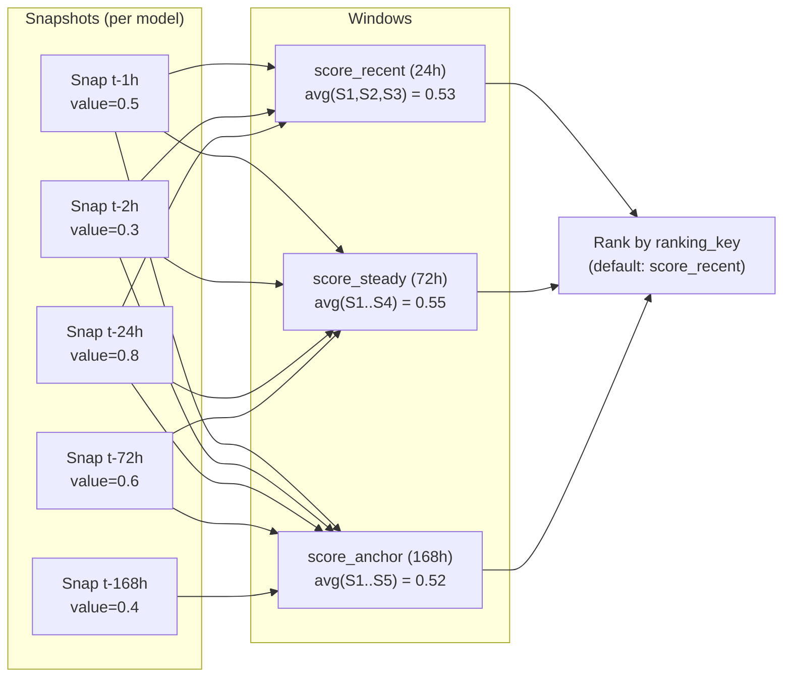

# Scoring & Aggregation

The scoring pipeline transforms raw predictions into ranked leaderboard entries through four stages: scoring, aggregation, windowing, and ranking.

## Scoring Flow



## Ground Truth Resolution

Two modes based on `resolve_horizon_seconds`:

### Immediate Resolution (`resolve_horizon_seconds = 0`)
Ground truth comes directly from `InputRecord.raw_data`. Used for live trading where the "truth" is the current market state.

### Deferred Resolution (`resolve_horizon_seconds > 0`)
The score worker waits until `resolvable_at`, then fetches feed records from the time window and passes them to `resolve_ground_truth()`:

```python
def default_resolve_ground_truth(
    feed_records: list[FeedRecord],
    prediction: PredictionRecord | None = None,
) -> dict | None:
    """Compute price return from entry and resolved feed records.

    Each feed record has flat OHLCV values (open, high, low, close,
    volume) — NOT nested candles_1m.
    """
    if not feed_records:
        return None
    entry = feed_records[0]
    resolved = feed_records[-1]
    entry_vals = entry.values or {}
    resolved_vals = resolved.values or {}
    if len(feed_records) == 1:
        entry_price = float(entry_vals.get("open") or entry_vals.get("price") or 0)
        resolved_price = float(entry_vals.get("close") or entry_vals.get("price") or 0)
    else:
        entry_price = float(entry_vals.get("close") or entry_vals.get("price") or 0)
        resolved_price = float(resolved_vals.get("close") or resolved_vals.get("price") or 0)
    if entry_price == 0:
        return None
    profit = (resolved_price - entry_price) / abs(entry_price)
    return {
        "symbol": resolved.subject,
        "asof_ts": int(resolved.ts_event.timestamp() * 1000),
        "entry_price": entry_price,
        "resolved_price": resolved_price,
        "profit": profit,
        "direction_up": resolved_price > entry_price,
    }
```

To customize ground truth (VWAP, cross-venue, labels, etc.), override `resolve_ground_truth` in your CrunchConfig:

```python
def my_resolve_ground_truth(feed_records, prediction=None):
    if not feed_records:
        return None
    entry = feed_records[0]
    resolved = feed_records[-1]
    # Each record has flat values: {open, high, low, close, volume}
    entry_price = float(entry.values.get("close", 0))
    resolved_price = float(resolved.values.get("close", 0))
    if entry_price == 0:
        return None
    return {
        "profit": (resolved_price - entry_price) / abs(entry_price),
        "direction_up": resolved_price > entry_price,
    }
```

## Scoring Function

The scoring function receives typed Pydantic objects (not dicts) and returns a dict or Pydantic model matching `score_type`. Access fields via attributes:

```python
def my_scorer(prediction: BaseModel, ground_truth: BaseModel) -> dict:
    pred_value = prediction.value
    actual_return = ground_truth.profit
    pnl = pred_value * actual_return
    return {
        "value": pnl,
        "actual_return": actual_return,
        "direction_correct": (pred_value > 0) == ground_truth.direction_up,
        "success": True,
    }
```

**Stateful scoring** is supported — set `CrunchConfig.scoring_function` to a callable that maintains state (e.g. a `PositionManager` instance). The score worker injects `model_id` and `prediction_id` as extra attributes on the prediction model before calling.

### Stub Detection

At startup, the score worker probes the scoring function with varied test inputs. If all results are identical, it's flagged as a stub:

```python
ScoreService.detect_scoring_stub(scoring_function)
# → (True, "returns identical value 0.0 for all test inputs")
```

## Snapshot Aggregation

`aggregate_snapshot()` receives all score result dicts for a period and produces a summary:

```python
def default_aggregate_snapshot(score_results: list[dict]) -> dict:
    """Average all numeric fields across score results."""
    # Input:  [{"value": 0.5, "pnl": 10}, {"value": 0.3, "pnl": -5}]
    # Output: {"value": 0.4, "pnl": 2.5}
```

- **Numeric fields** — averaged across all results
- **Non-numeric fields** — taken from the latest result
- **Failed scores** (`success=False`) — excluded from aggregation

## Leaderboard: Windowed Averaging



The leaderboard builder:
1. Reads snapshots for each model within each window's time range
2. Extracts `value_field` (default `"value"`) from each snapshot's `result_summary`
3. Averages across the window
4. Merges latest snapshot's numeric fields as additional metrics
5. Ranks all models by `ranking_key` in `ranking_direction`

## Auto Report Schema

The report worker auto-generates leaderboard column definitions by introspecting `score_type`:

```python
# If score_type has fields: value, pnl, sharpe, max_drawdown
# → auto_report_schema() generates columns for each field
# → UI renders them without manual configuration
```

## Multi-Metric Scoring

In addition to the primary `scoring_function`, CrunchConfig supports computing additional metrics over batches of predictions:

```python
metrics = ["ic", "ic_sharpe", "hit_rate", "max_drawdown", "model_correlation"]
compute_metrics = default_compute_metrics  # uses built-in registry
```

Built-in metrics:
- **IC** — Information Coefficient (Spearman correlation of predictions vs outcomes)
- **IC Sharpe** — IC stability (mean/std of rolling IC)
- **Hit Rate** — fraction of directionally correct predictions
- **Max Drawdown** — worst cumulative loss
- **Model Correlation** — average pairwise correlation between models (diversity measure)
